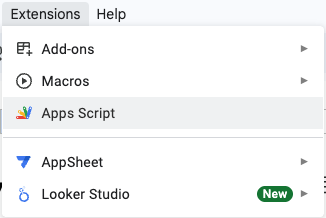

# Installation

This script is currently distributed from our Github repo of API demos,
the latest version can be found at https://github.com/rewiringamerica/api_demos

Copy paste the entire script from [Code.gs](Code.gs) into the Google Apps
Script editor. The editor can be found in the Extensions menu of Google
Sheets:



# Usage

The script exposes a custom function (formula) for use in your spreadsheet.

Example usage, in a cell in your spreadsheet type the following:

```
=REM('Your address','baseline','natural_gas','natural_gas','YOUR_API_KEY')
```

## Requirements

- REM may not work with every address, especially not fake or famous addresses
  that you might quickly type (like 123 Main St!). Use a real single family
  home in the US, and let us know if you find one that doesn't work.
- You must pass valid values for the upgrade scenario and heating fuels.
  Check the API documentation at https://api.rewiringamerica.org for details.
- You must register for an API key to replace the string YOUR_API_KEY.

## Tips

The REM function returns multiple tables. There is no formatting applied to
the table. The shape and size of the table is stable for all inputs, so you
can format the results directly if you like. Or put the results in a hidden
tab in your spreadsheet and pull the numbers you want into your other sheets
and formulas.

For a simple report, we suggest using the `mean` values in the `total` section,
focused on the `delta` for `energy`, `emissions`, and `cost` impact. The
`delta` values are the change between `baseline` and `upgrade`. For users who
want more details, pull from the break-downs per fuel type, or take a look at
the metadata tables that indicate the energy rates used to inform the
calculations.
